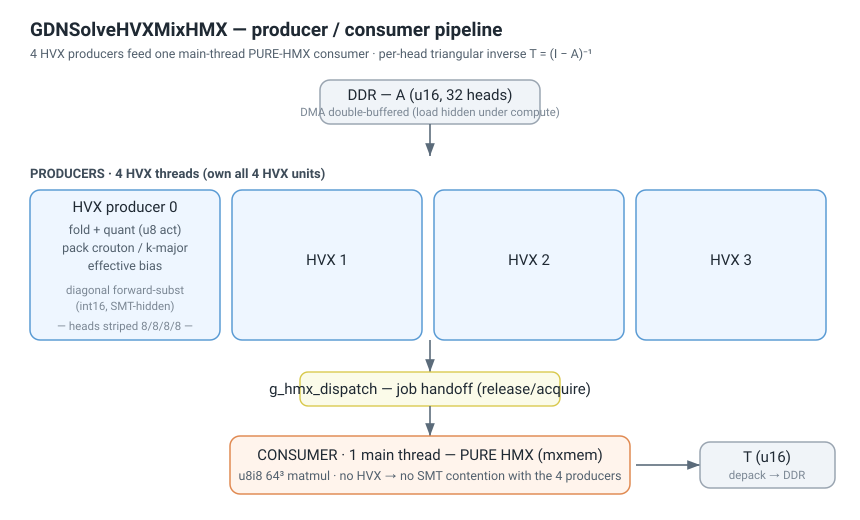
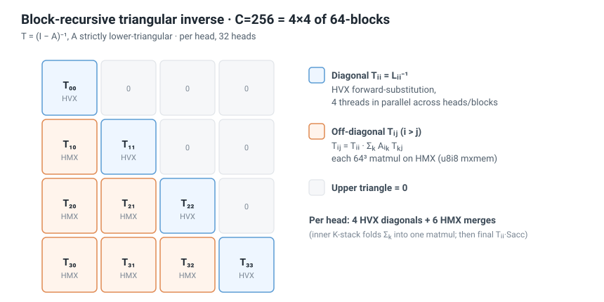
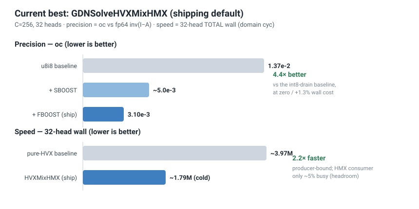
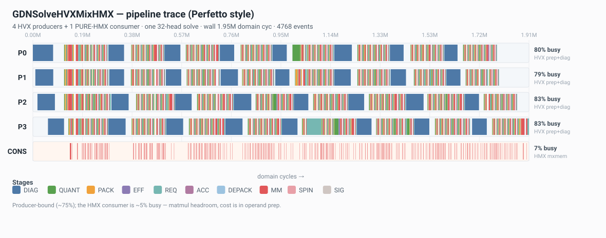

# GDN Triangular Inverse on Hexagon HTP — Best Implementation

Per-head triangular inverse **T = (I − A)⁻¹** for GDN / KDA linear-attention, running on the
Qualcomm v75 HTP (HVX + HMX). This is the core kernel: a block-recursive solve that feeds the
HMX matrix engine from four HVX producer threads.

**Headline (C=256, 32 heads):**

| | value | |
|---|---|---|
| **Precision** `oc` (vs fp64 `inv(I−A)`) | **3.10 × 10⁻³** | **4.4×** better than the int8-drain baseline (1.37 × 10⁻²) |
| **Speed** 32-head TOTAL wall | **~1.79 M** domain cyc (cold) | **~2.2×** faster than the pure-HVX route |
| **Correctness** | diagonal blocks bit-exact; precision gains oracle-verified | |

---

## 1. Architecture — HVX feeds, HMX computes



A producer/consumer split that keeps every hardware unit busy:

- **4 HVX producers** own all 4 HVX units. Each prepares matmul operands (fold → quant → pack
  crouton/k-major → effective bias) and solves diagonal blocks by forward-substitution. Heads are
  striped 8/8/8/8 across the threads.
- **1 main-thread PURE-HMX consumer** runs only `mxmem` 64³ matmuls. Because it never touches an
  HVX unit, the 4 producers never contend with it for SMT issue slots — the single biggest reason
  this layout beats a naive one.
- The hand-off is a lightweight release/acquire job hook (`g_hmx_dispatch`); A is streamed from DDR
  with double-buffered DMA so the load is hidden under compute.

The kernel is **producer-bound** (~75% busy); the HMX consumer sits at ~5–6%, i.e. there is ample
matmul headroom — the cost is in operand preparation, not the matmuls.

---

## 2. Algorithm — block-recursive solve



C=256 is cut into a 4×4 grid of 64-blocks. For `L = I − A`:

- **Diagonal `Tᵢᵢ = Lᵢᵢ⁻¹`** — HVX forward-substitution (serial per block, but parallel across the
  4 threads). Written directly in int16 (no int32 round-trip).
- **Off-diagonal `Tᵢⱼ = Tᵢᵢ · Σₖ Aᵢₖ Tₖⱼ`** (i > j) — each 64³ matmul runs on HMX. The inner
  `Σₖ` is folded into one K-stacked matmul (single drain), then a final `Tᵢᵢ · Sacc` merge.

Per head: 4 HVX diagonal solves + 6 HMX off-diagonal merges (each merge = 1 inner + 1 final matmul).

---

## 3. Performance & precision



**Measured pipeline trace** (`-DGDN_BR_TRACE` → `scripts/gdn_perfetto_timeline.py`):



The four producers run 79–83% busy on operand prep + diagonal solves; the HMX consumer is ~7%
busy on pure `mxmem`. The cost is operand preparation, not the matmuls — there is large HMX headroom.

**Metric discipline** (important for reproducing the numbers):

- The only authoritative speed figure is **C=256, 32-head TOTAL wall (domain cyc)**. Per-head,
  min-of-reps, and per-stage probes are all misleading and not used.
- Absolute wall drifts with device thermal state (~1.7–1.8 M cold, ~1.9–2.1 M warm). For comparing
  two builds, use **interleaved A/B (ACAC… median)** against a same-moment reference — this cancels
  the thermal drift.

---

## 4. How the precision/speed is reached

Four toggles, all on by default in the shipping flag set:

| toggle | what it does | effect |
|---|---|---|
| `SBOOST` | per-distance Sacc drain-gain calibration {5.5, 12, 20} (the Hölder bound is ~16× loose) | oc 1.37e-2 → ~5e-3, **zero wall** |
| `FBOOST` | boost the final drain (the dominant error source) to sTw/2 + a bit-exact ÷2 re-narrow downstream | oc → **3.10e-3** (1.27×), wall +1.3% |
| `DIAG_I16` | diagonal forward-subst writes int16 directly, skipping an int32 widen/narrow round-trip | wall **−6.2%**, bit-exact |
| `REQ_FUSE` | fuse the final-merge widen + requant into one pass (drop a redundant VTCM read) | wall **−0.9%**, bit-exact |

The full optimization log — including the dead ends (w16a16 = ×2.55 wall, a16w8 capped at 1.11× by
the int8 weight quant, pack-vshuff locked by the HMX `:deep` weight layout) — lives in
`Agent/current/gdn_opt_ledger.md`.

---

## 5. Reproduce

**Build** (default flag set = the shipping best):

```bash
cd example/gdn_native/baremetal
EXTRA_DEFS="-DGDNBM_HMX_PIPE -DGDN_BR_STATIC_GAIN -DGDN_BR_STATIC_FULL \
  -DGDN_BR_SBOOST -DGDN_BR_DIAG_I16 -DGDN_BR_REQ_FUSE -DGDN_BR_FBOOST" bash build.sh
# -> build/libgdnbm_skel.so (DSP) + build/gdnbm (aarch64 host driver)
```
Requires a Hexagon SDK + Android NDK + QNN SDK toolchain (paths via `scripts/env.sh`).

**Run on device** (`DSSH_HOST` overrides the target; helper in `scripts/dssh.sh`):

```bash
source scripts/dssh.sh; dssh_open "${DSSH_HOST:-<your-v75-device>}"; W=$(dssh 'echo $HOME/gdnbm_run')
dssh "cat > $W/libgdnbm_skel.so" < build/libgdnbm_skel.so
dssh "cat > $W/gdnbm" < build/gdnbm; dssh "chmod +x $W/gdnbm"
dssh "cd $W && GDNBM_REPS=8 LD_LIBRARY_PATH=$W:/vendor/lib64:/system/lib64 \
  ADSP_LIBRARY_PATH='$W;/vendor/lib/rfsa/adsp;/vendor/dsp/cdsp;/dsp/cdsp' \
  ./gdnbm 4 A_u16_h32.raw T.raw 32 256 32768 32768 2.770166930875267e-05 6.103701895199438e-05"
# arg order: <nthreads> <A.raw> <T.raw> <H> <C> <zpA> <zpT> <sA> <sT>
```
Take the **median of reps 2–4** (rep 1 is cold, rep ≥5 throttles); never the min.

**Verify precision** (pull `T.raw`, compare to fp64):

```python
import numpy as np
C, sA, sT = 256, 2.770166930875267e-05, 6.103701895199438e-05
A  = (np.fromfile('A_u16_h32.raw', np.uint16).reshape(32,C,C).astype(np.int64)-32768)*sA
Te = np.stack([np.linalg.inv(np.eye(C)-A[h]) for h in range(32)])
T  = (np.fromfile('T.raw',         np.uint16).reshape(32,C,C).astype(np.int64)-32768)*sT
print("oc =", np.linalg.norm(T-Te)/np.linalg.norm(Te))   # ~3.10e-3
```

`A_u16_h32.raw` / `T_ref_h32.raw` are GDN-layer I/O from a real Qwen3.5-4B run; regenerate with
`scripts/gdn_extract_golden.py`.

---

## 6. Optional: extreme min-wall variant

Add `-DGDN_BR_SKIPFIN_D3` to skip the farthest block's (d=3) final merge — `T₃₀ ≈ Sacc`. This trades
precision for a further **−2.7%** wall: `oc 9.56e-3` (still < 1e-2). The default ships full precision
(3.10e-3); use this only when wall is paramount.

---

## Sibling route: pure-HMX (`GDNSolveHMX`)

A second, faster route runs **every** matmul — including the diagonal-block inversion — on the HMX
engine, with all intermediates VTCM-resident: **[`gdn_inverse_pure_hmx.md`](gdn_inverse_pure_hmx.md)**
(`GDNSolveHMX`, ~1.258 M / **−26%** vs the native baseline, vs this HVXMixHMX route's ~1.79 M). The two
are different designs, not versions of each other; pick per integration constraints. Both routes and the
shipping baseline pure-HVX route are tabulated in the authoritative engineering doc
`Agent/current/gdn_solve.md`.

---

*Implementation files: `example/gdn_native/solve_br_op/src/GdnSolveBR16.cpp` (int16 static solve),
`baremetal/src/gdnbm_imp.cpp` (FastRPC + pipeline), `solve_br_op/src/GdnSolveBROp.cpp` (pack / quant /
merge / diagonal / HMX-kernel helpers). Authoritative engineering doc: `Agent/current/gdn_solve.md`.*
