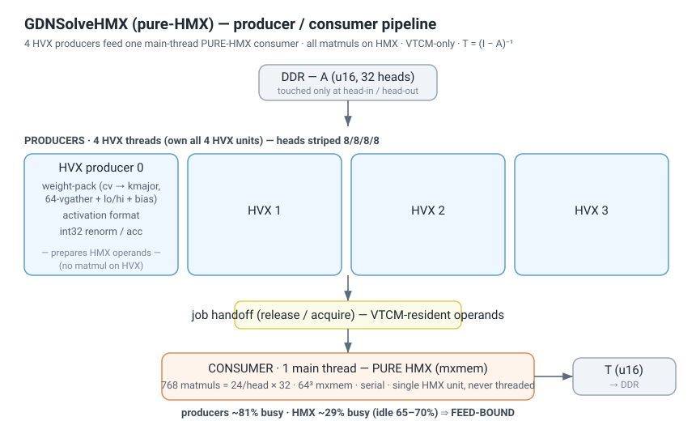
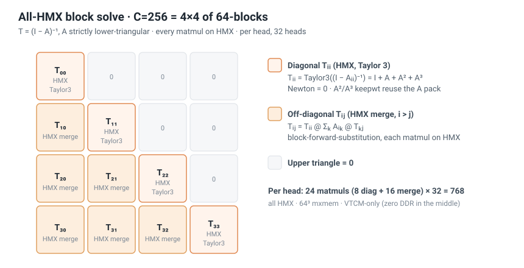
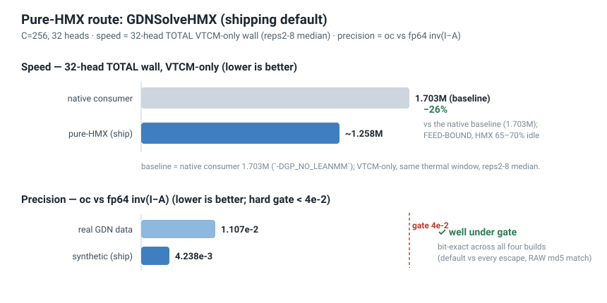
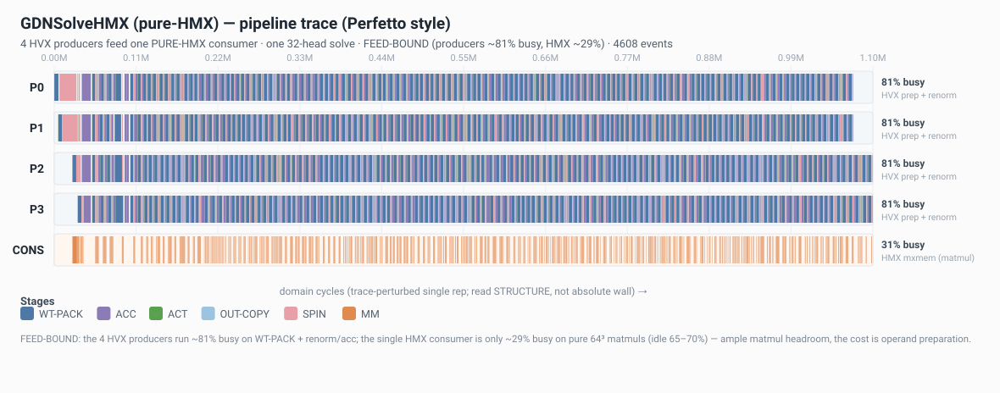

# GDN Triangular Inverse on Hexagon HTP — Pure-HMX Route

Per-head triangular inverse **T = (I − A)⁻¹** for GDN / KDA linear-attention, running on the
Qualcomm v75 HTP (HVX + HMX). This is the **pure-HMX** route (`GDNSolveHMX`): *every* matmul —
including the diagonal-block inversion — runs on the HMX engine, with all intermediate state held
resident in VTCM (DDR touched only at head-in / head-out). It is a sibling of the HVX-feeds-HMX
route documented in [`gdn_inverse.md`](gdn_inverse.md); see *Relationship to HVXMixHMX* below.

**Headline (C=256, 32 heads):**

| | value | vs baseline |
|---|---|---|
| **Speed** — 32-head TOTAL wall (VTCM-only) | **~1.258 M** cyc | **−26%** vs native 1.703 M |
| **Precision** — `oc` vs fp64 `inv(I−A)` | **4.238 × 10⁻³** (synthetic) · **1.107 × 10⁻²** (real GDN) | hard gate `< 4 × 10⁻²` ✓ |
| **Correctness** | **bit-exact** (default vs every escape) | RAW md5 match · `LEANCHK_LIVE max|d|=0`, checked=768 |

> **Measurement discipline** is non-negotiable for this number; see §3. Wall is the **32-head
> TOTAL VTCM-only** wall, reps 2–8 **median** (never min), P=4. The DDR↔VTCM bulk head-load/store
> is a standalone-harness artifact and is excluded from the timing window.

---

## 1. Architecture — HVX feeds, HMX computes everything



A producer/consumer split where the HMX engine owns *all* the arithmetic:

- **4 HVX producers** own all 4 HVX units. Each prepares matmul operands — weight-pack
  (cv → kmajor 64-vgather + lo/hi + bias), activation formatting, and the int32 renorm/accumulate
  path. Heads are striped across the threads.
- **1 main-thread PURE-HMX consumer** runs only 64³ `mxmem` matmuls — 768 of them (24 per head ×
  32 heads), strictly serial. HMX is a **single** unit and is never threaded.

The per-matmul critical chain is **ACT → WT-PACK (#1 long pole, ~4 K cyc) → SPIN → OUT → ACC**.

The kernel is **FEED-BOUND** (measured, cron#82/#83): after the lean consumer kernel landed, the
consumer occupies only ~0.379 M of the wall while feed/P ≈ 1.0 M dominates. Each HVX producer runs
~81% busy; the **HMX unit is only ~29% busy (idle 65–70%)** — there is ample matmul headroom, and
the cost lives entirely in operand preparation. (The quantitative feed-bound proof — the P-fit
`wall = 4.136 M / P + 0.376 M` — is in §3.)

---

## 2. Algorithm — all-HMX block solve



C=256 is cut into a 4×4 grid of 64-blocks. For `L = I − A`:

- **Diagonal `Tᵢᵢ = Lᵢᵢ⁻¹`** — a **Taylor(3)** truncation of `(I − Aᵢᵢ)⁻¹` (`I + A + A² + A³`),
  with Newton=0. On this w16a16 device that is the precision sweet spot: each Newton-Schulz step
  adds more quant noise than truncation gain. `A²` and `A³` reuse the `A` weight pack (diagonal
  weight reuse, `keepwt`). Each diagonal block = 2 matmuls (`A²`, `A³`) under the staged Taylor sum.
- **Off-diagonal block-forward-substitution merge `Tᵢⱼ`** (i > j) — `Σₖ Aᵢₖ @ Tₖⱼ` accumulated,
  then a final `Tᵢᵢ @ S` merge. Each merge = inner matmuls + 1 final matmul.

Per head: **24 matmuls** (8 diagonal + 16 merge), over 32 heads = 768 matmuls total. All run on HMX
as 64³ `crouton_pos` n_tiles=8 calls; all intermediate blocks are VTCM-resident (zero DDR in the
middle).

---

## 3. Performance & precision



**Measured pipeline trace** (`-DGP_TRACE` → `scripts/gdn_pure_perfetto_timeline.py`, or the
QNN-aligned report `scripts/gdn_solve_qnn_aligned_report.py`):



The four producers run ~81% busy on weight-pack + renorm/acc; the single HMX consumer is ~29% busy
on pure 64³ matmuls (idle 65–70%). The cost is operand preparation, not the matmuls. Per-thread
ASCII timeline evidence: `Agent/current/timeline_cron85_wtcache.txt` (wt-cache structure) and
`Agent/current/timeline_cron87_B.txt` (lever-B accounting).

**Feed-bound proof (P-fit).** Sweeping the producer count gives `wall = 4.136 M / P + 0.376 M`; the
slope (4.136 M) matches the independently-measured total HVX work Σ (4.02 M) within 3%, and the
serial floor `b_serial ≈ 0.376 M` matches the lean consumer occupancy. Wall scales with feed÷P, not
with the matmuls — the kernel is feed-bound (consumer ~0.379 M ≪ feed/P ≈ 1.0 M at P=4).

**Metric discipline** (violating any of these invalidates the result):

  ▸ **WHAT to measure** — the only authoritative speed figure is **C=256, 32-head TOTAL wall,
    VTCM-only**. Per-head (a tiler artifact), min-of-reps, per-stage probes, and `cycles_used ÷ N`
    are all forbidden.
  ▸ **WHICH fields** — QNN optrace only: `cycles_used` (per-unit occupancy) + `num_dominant_path`
    (critical chain) + graph wall (`max(end) − min(start)`). All are PCYCLE. Clock self-check:
    `wall/µs ≈ 1594` (TURBO); a value far above this means a misread counter.
  ▸ **HOW to compare** — absolute wall drifts with thermal state; use **same-thermal-window ACAC
    interleaved A/B, reps 2–8 median** to cancel the drift. Never compare against a fixed constant.
  ▸ **WHAT to exclude** — the DDR↔VTCM bulk head-load/store (bulk_ld ~1.19 M / bulk_st ~0.26 M) is a
    standalone-harness artifact (in production A already arrives in crouton layout). Reported
    separately and **excluded** from the wall.

**Bit-exact, not asserted:** the default (lean + wt-cache + lever-B) build vs each escape build
(`-DGP_NO_LEANMM` / `-DGP_NO_WTCACHE` / `-DGP_NO_INPLACE_RENORM`) emit a **byte-identical** 32-head
4 MB `T` output (RAW md5 match across 3 thermal windows). `GP_LEANCHK_LIVE` per-conv shadow gives
`max|d| = 0`, checked=768 (= 32 heads × 24 conv, full coverage); `PACKCHK = 0`; `oc` invariant at
4.238 × 10⁻³.

**Cumulative wall reduction — three orthogonal levers** (all bit-exact, all production-default):

```
  native consumer    |##############################################| 1.703 M   (-DGP_NO_LEANMM escape)
  + lean consumer    |######################################        | 1.391 M   -18.3%
  + wt-cache         |###################################           | ~1.30 M   -7.6%
  + lever B          |##################################            | 1.258 M   -3.1%   <- shipping default
                     +----------------------------------------------+
                     0                                          1.703 M
                                                          === -26% vs native ===
```

---

## 4. How the speed is reached

Three orthogonal levers, **all on by default** in the shipping build (each has a default-ON
`#ifndef` escape to disable it):

| lever | what it does | effect |
|---|---|---|
| **lean consumer** (cron#83, `d075ccd`) | a clean from-scratch streaming 64³ kernel that strips the bias-staircase + M-loop bloat of `convhhh` (4.3× more packets/stalls) | consumer occupancy 1.31 M → 0.38 M; wall **−18.3%**, bit-exact |
| **wt-cache** (cron#87, `01c5376`) | per-producer cache of packed merge T-weights, keyed by the cv source pointer; eliminates 128 redundant cross-diagonal re-packs that `keepwt` cannot catch | WT-PACK 768 → 512; wall **−7.6%**, bit-exact |
| **lever B** (cron#89, `89927c4`) | merge-final in-place int16 renorm — drops 6 redundant int32 round-trips that had no accumulation | wall **−3.1%** (in-prod) / −3.9% (gated), bit-exact* |

Cumulative: **native 1.703 M → lean (−18.3%) 1.391 M → +wt-cache (−7.6%) ~1.30 M →
+lever-B (−3.1%) ~1.258 M ≈ −26% vs native**, all bit-exact (see the §3 waterfall).

> *Lever B caveat (honest): its bit-exactness depends on the data invariant `cv ∈ [−32639, 32639]`
> (maintained by solve renorm + the to_cv clamp — a data invariant, **not** a compile-time
> guarantee). If a `cv` of −32768 ever appears, int16 absmax may diverge from int32 absmax. The
> `#else` / `-DGP_NO_INPLACE_RENORM` int32 path is retained as the oracle/escape.

**Build matrix** — default = all three levers ON; each lever has one default-ON `#ifndef` escape:

| build flags (on top of `-DGDNBM_GDN_PURE_SOLVE`) | lean | wt-cache | lever B | wall | role |
|---|:--:|:--:|:--:|---|---|
| *(none)* = shipping default | ON | ON | ON | ~1.258 M | production |
| `-DGP_NO_LEANMM` | off | ON | ON | ~1.703 M | native oracle |
| `-DGP_NO_WTCACHE` | ON | off | ON | ~1.363 M | no-cache feed |
| `-DGP_NO_INPLACE_RENORM` | ON | ON | off | ~1.302 M | int32 oracle |

All four builds emit a byte-identical 32-head `T` (RAW md5 match) — the escapes are correctness
oracles, not perf variants. (Walls are ACAC-paired against the default in one thermal window,
reps 2–8 median; the `-DGP_NO_WTCACHE` / `-DGP_NO_INPLACE_RENORM` rows are device-measured here, the
default / `-DGP_NO_LEANMM` rows are the authoritative figures from `docs/cycle_metric_alignment.md`.)

**Refuted dead-ends** (measured, do not retry) — the bottleneck is feed-bound and the two largest
feed levers were measured and refuted:

| lever tried | result | why |
|---|---|---|
| add producers (P > 4) | ❌ +25.6% (P=6) | v75 has only 4 HVX units; P>4 over-subscribes (cron#84) |
| wt-vec vgather → vshuff | ❌ 0% wall | bit-exact but Σ unchanged ⇒ wt-pack is HW-irreducible kmajor byte-pack + SMT contention, NOT gather-bound (cron#84) |
| merge-final transpose reuse (6→3 packs) | ❌ net loss | needs 15 perms/head (cron#86) |

The full optimization log and the dead-end audit trail (adding P / vshuff / transpose-reuse all
REFUTED; Newton-Schulz on this device is counter-productive) lives in
`Agent/current/pure_hmx_solve_build.md`; the cross-route ledger is `Agent/current/gdn_opt_ledger.md`.

---

## 5. Reproduce

**Build** (default flag set = the shipping best = lean + wt-cache + lever-B all on):

```bash
EXTRA_DEFS="-DGDNBM_GDN_PURE_SOLVE" bash example/gdn_native/baremetal/build.sh
# -> build/libgdnbm_skel.so (DSP) + build/gdnbm (aarch64 host driver)
```
Requires a Hexagon SDK + Android NDK + QNN SDK toolchain (paths via `scripts/env.sh`).

**Run on device** (the host script deploys + runs + computes `oc`; `dssh.sh` is the ControlMaster
mux for the device ssh):

```bash
source scripts/dssh.sh
uv run python scripts/run_w16a16_head_phase4.py --deploy --threads 4 --heads 32 --scale 0.05 --reps 8
# 32-head TOTAL VTCM-only wall ~1.258 M (the script prints "WALL reps2-N MEDIAN=...")
```
Take the **reps 2–8 median**; never the min. For an A/B speed comparison, interleave the default
build against the escape build in the same thermal window (ACAC), reps 2–8 median each.

**Verify precision** (`oc` is printed by the run; gate `< 4 × 10⁻²`):

```
H=32 oc mean=4.238e-03 ...     # synthetic scale 0.05
```

**Verify correctness (bit-exact)** — build with the live per-conv shadow, or diff the escape output:

```bash
# (a) per-conv shadow gate: host prints "LEANCHK_LIVE max|d|=0 checked=768"
EXTRA_DEFS="-DGDNBM_GDN_PURE_SOLVE -DGP_LEANCHK_LIVE" bash example/gdn_native/baremetal/build.sh
uv run python scripts/run_w16a16_head_phase4.py --deploy --threads 4 --heads 32 --scale 0.05 --reps 8

# (b) the three orthogonal escapes (see the §4 build matrix for their roles + walls) —
#     each must emit a byte-identical 32-head T:
EXTRA_DEFS="-DGDNBM_GDN_PURE_SOLVE -DGP_NO_LEANMM"         bash example/gdn_native/baremetal/build.sh
EXTRA_DEFS="-DGDNBM_GDN_PURE_SOLVE -DGP_NO_WTCACHE"        bash example/gdn_native/baremetal/build.sh
EXTRA_DEFS="-DGDNBM_GDN_PURE_SOLVE -DGP_NO_INPLACE_RENORM" bash example/gdn_native/baremetal/build.sh
```
`A_u16_h32.raw` / `T_ref_h32.raw` are GDN-layer I/O from a real Qwen3.5-4B run; regenerate with
`scripts/gdn_extract_golden.py`.

---

## 6. Structural floor & the sub-1.0 M trade-off

The clean (non-precision) path is already at its **structural floor** (cron#86) — these four facts
each block a clean lever:

```
  ✓ WT-PACK = 16/head  — the per-matmul-weight minimum, zero cross-head reuse
  ✓ cv → kmajor bridge — structurally unavoidable (HMX cannot produce or permute kmajor)
  ✓ HMX 65–70% idle    — physically cannot absorb HVX work (the bound is total HVX量, feed-bound)
  ✓ int32 accumulators — legally necessary (diag / merge-S overflow int16)
```

⇒ Reaching **≤ 1.0 M** needs an **algorithm/precision trade-off** (fewer matmuls / lower Taylor
order), crossing the `oc` sweet spot — this **requires precision authorization and has NOT been
done**. There is no clean-path ≤ 1.0 M variant; the default ships full precision (4.238 × 10⁻³). The
full cron#86 reasoning is in `Agent/current/pure_hmx_solve_build.md`.

---

## Relationship to HVXMixHMX

Two distinct routes coexist in the three-route table of the authoritative engineering doc
`Agent/current/gdn_solve.md`:

- **Pure-HMX (`GDNSolveHMX`, this doc)** — *all* matmuls on HMX (diagonal inversion included),
  VTCM-only intermediates. **~1.258 M** (−26% vs native).
- **HVXMixHMX (`GdnSolveBR16.cpp`, [`gdn_inverse.md`](gdn_inverse.md))** — diagonal blocks solved
  by HVX forward-substitution, only the off-diagonal merges on HMX. **~1.79 M**.

They are different designs, not versions of each other; pick per integration constraints.

---

*Implementation files: `example/gdn_native/pure_hmx_solve/gdn_pure_solve.cpp` (the single real
solve path — edit here), `pure_hmx_solve/lean_mm64.h` (lean consumer kernel),
`pure_hmx_solve/w16a16_mm.h` (64³ w16a16 primitive). Authoritative engineering doc:
`Agent/current/gdn_solve.md`. Optimization process / dead-end audit: `Agent/current/pure_hmx_solve_build.md`.*
</content>
</invoke>
