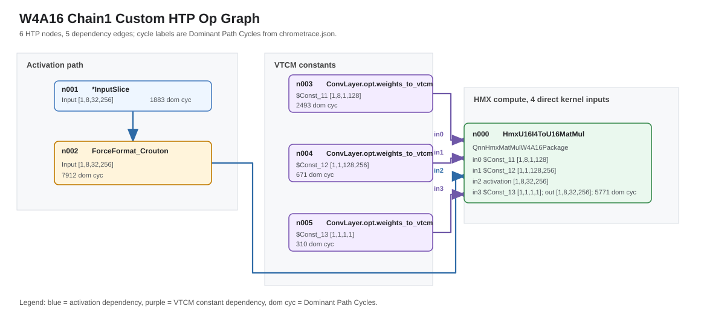
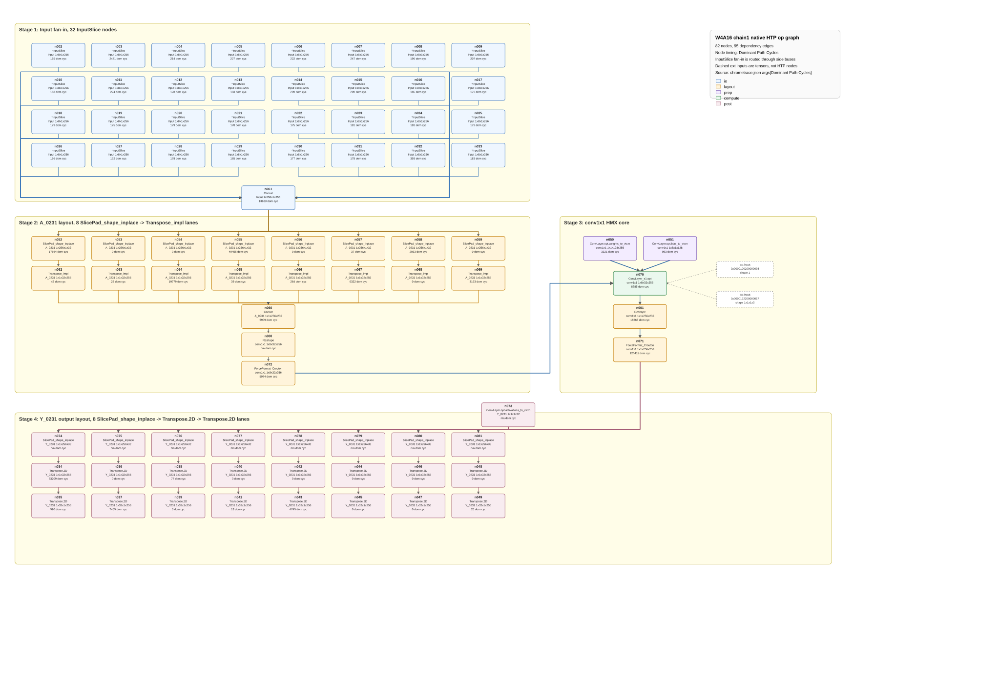

# W4A16 Chain1 HTP Op Flow

This note compares the `M=N=K=256`, `CHAIN=1` W4A16 custom-op and QNN Native
HTP op graphs.

## Trace Sources

| Flow | Artifact | Graph source | Timing source |
|---|---|---|---|
| Custom op | `example/qnn_matmul_profile/output_w4a16_chain1_default_ci_e2e_256` | `optrace/chrometrace_htp.json` | `optrace/chrometrace.json` |
| QNN Native | `example/qnn_matmul_profile/output_w4a16_native_chain1_default_ci_e2e_256` | `optrace/chrometrace_htp.json` | `optrace/chrometrace.json` |

Rules used in both drawings:

- `chrometrace_htp.json` is the node/edge source of truth.
- Node cycle labels are `chrometrace.json` `args["Dominant Path Cycles"]`.
- Op labels drop only the leading `q::`; types such as
  `ForceFormat_Crouton` and `SlicePad_shape_inplace` are not shortened.

## Custom Op

Custom graph size: `6` HTP nodes, `5` dependency edges. All 6 nodes have
dominant-path cycle labels.



The custom graph exposes the prepared HMX contract directly.
`HmxU16I4ToU16MatMul` has four direct input tensors in
`chrometrace_htp.json`: `$Const_11` `[1,8,1,128]`, `$Const_12`
`[1,1,128,256]`, formatted activation `[1,8,32,256]`, and `$Const_13`
`[1,1,1,1]`.

## QNN Native

Native graph size: `82` HTP nodes, `95` dependency edges. The SVG keeps all
nodes from `chrometrace_htp.json`; repeated `InputSlice`,
`SlicePad_shape_inplace`, `Transpose_impl`, and `Transpose.2D` lanes are not
collapsed.



Native stage accounting:

| Stage | Nodes | Count |
|---|---:|---:|
| Input slices | `n002..n033` | 32 |
| Input concat | `n061` | 1 |
| A-layout lanes | `n052..n059`, `n062..n069` | 16 |
| A concat/reshape/format | `n060`, `n000`, `n072` | 3 |
| Conv prep/core/post | `n050`, `n051`, `n070`, `n001`, `n071` | 5 |
| Y-layout helper/slices | `n073..n081` | 9 |
| Y-layout transposes | `n034..n049` | 16 |
| Total | `n000..n081` | 82 |

`n070` (`ConvLayer_s1.opt`) has five input tensors. Three are produced by HTP
nodes (`n072`, `n050`, `n051`) and appear as graph edges. The other two are
external/non-HTP tensors, so the SVG shows them as dashed input badges, not as
extra HTP nodes.

## Equality To Torch

The target semantic operation is:

```text
C_torch[M,N] = A[M,K] @ W[K,N]
```

The custom public output is already in torch-facing `[M,N]` order. QNN Native
uses a different public `Y` order, so comparison uses a 2D transpose of the
native raw buffer:

```text
torch_ref == custom_out == transpose2d(qnn_native_Y)
```

Current raw-buffer evidence:

- torch reference vs custom: `65536/65536`, `maxdiff=0`;
- custom vs transposed native: `65536/65536`, `byte_differences=0`;
- custom vs native raw public order is not equal: `1278/65536`.

## Interpretation

Both paths reach the same internal compute shape:

```text
activation input: [1,8,32,256]
compute output:   [1,8,32,256]
```

The extra QNN Native nodes are the boundary tax for its Conv-style public
contract: slice/concat/layout-convert the input, stage weights and bias, run
`ConvLayer_s1.opt`, then convert the output back to public `Y` layout. The
custom op skips most of that because its HTP graph accepts the prepared tiled
contract.
